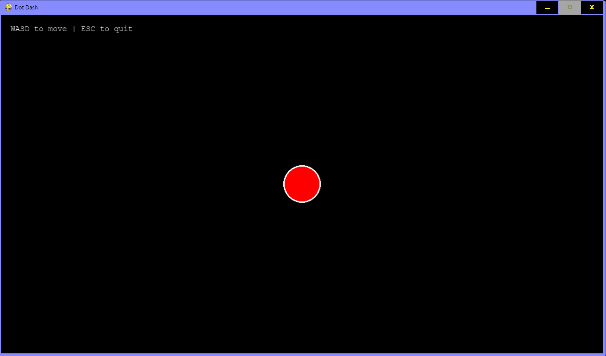
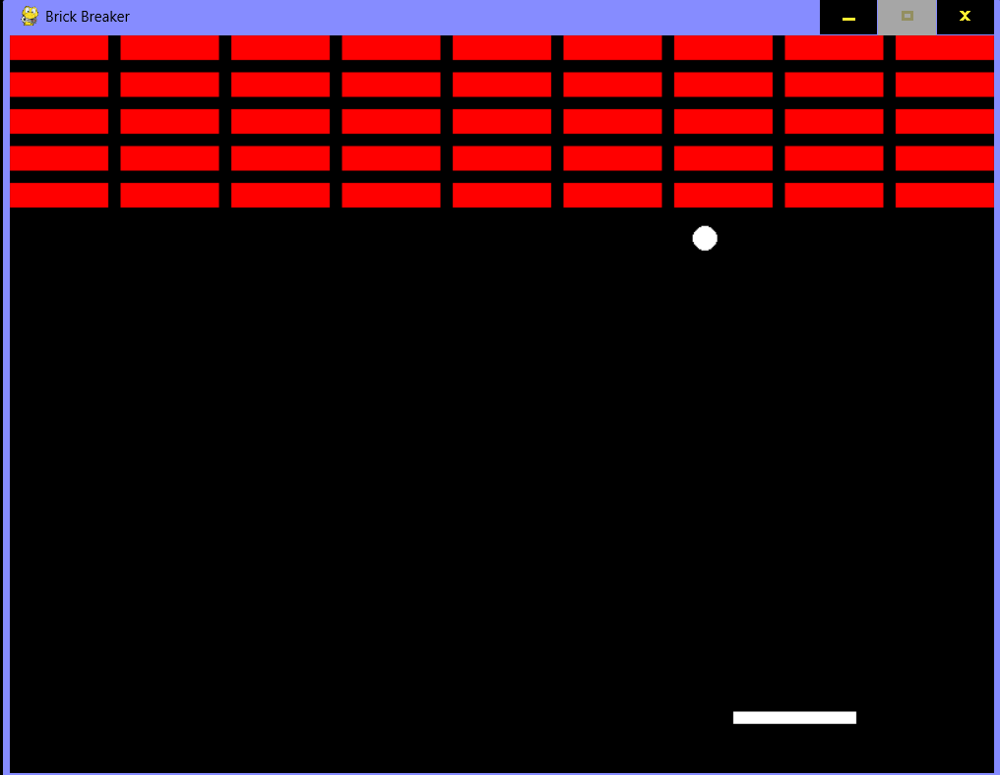
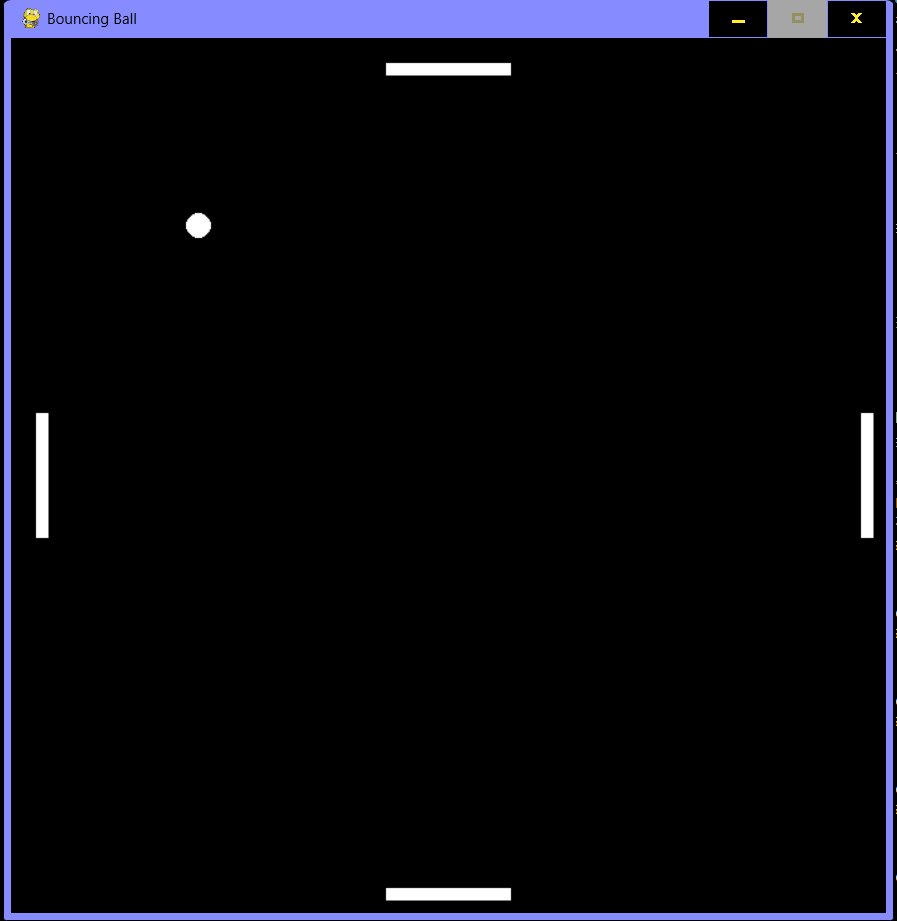
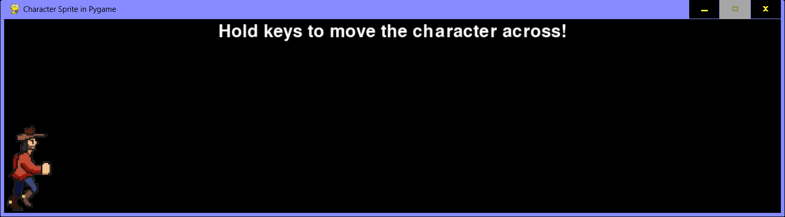
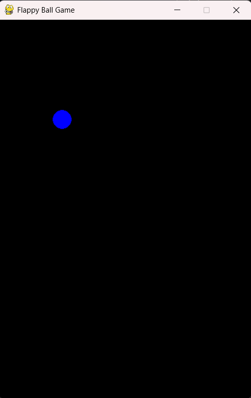

# PyGameLab

Once upon a boring spring, with a week’s holiday and an empty hostel…  
I decided to pick up a new hobby — that’s when I tried my hands on **Pygame**.  
It was fun if nothing else, and I’ll be catching on soon! INDEED!!  

---

## 🕹️ What’s Inside?  
A bunch of mini-games I built while learning Pygame.  
Some are cool, some are broken — all are part of the journey!  

- **DotDash** → Moving shapes & basic controls 
- **BrickBreaker** → Collision detection & paddle logic 
- **BouncingBall** → Multi-directional controls (needs fixing!)  
- **RunToTheEdge** → Sprite sheets & restart mechanics  
- **FlappyBall** → Gravity, jump physics & win conditions  

---

## Folder Structure

    PyGame_Labs
    │   1.DotDash.py
    │   2.BrickBreaker.py
    │   3.BouncingBall.py
    │   4.Run_to_the_edge.py
    │   5.FlappyBall.py
    │   README.md
    │   
    └───demo_images
            BouncingBall_demo.png
            BrickBreaker_demo.png
            DotDash_demo.png
            FlappyBall_demo.png
            RunToTheEdge_demo.png

---

## Game Preview and Key Learnings

### 1. DotDash
| | |
|-|-|
| **Preview** |  |
| **Description** | A simple game where a circle moves with WASD keys. |
| **Key Learnings** | - Drawing objects (circles) - Displaying text in Pygame |

---

### 2. BrickBreaker
| | |
|-|-|
| **Preview** |  |
| **Description** | Classic paddle-ball brick breaker. |
| **Key Learnings** | - Difference: `pygame.draw.rect()` vs `pygame.Rect()` - Collision detection & movement logic |

---

### 3. BouncingBall
| | |
|-|-|
| **Preview** |  |
| **Description** | A ball bounces with four paddles (W/S, A/D, arrows). |
| **Key Learnings** | - Extended logic from BrickBreaker - Learned win/restart conditions - Multi-direction controls (too messy, needs fixing!) |

---

### 4. RunToTheEdge
| | |
|-|-|
| **Preview** |  |
| **Description** | Sprite character runs to the screen edge. |
| **Key Learnings** | - Using sprite sheets - Dynamic text effects (like GIF) - Restart feature |

---

### 5. FlappyBall
| | |
|-|-|
| **Preview** |  |
| **Description** | Gravity-based ball that jumps with spacebar. |
| **Key Learnings** | - Gravity & jump mechanics - Dynamic win message display |
