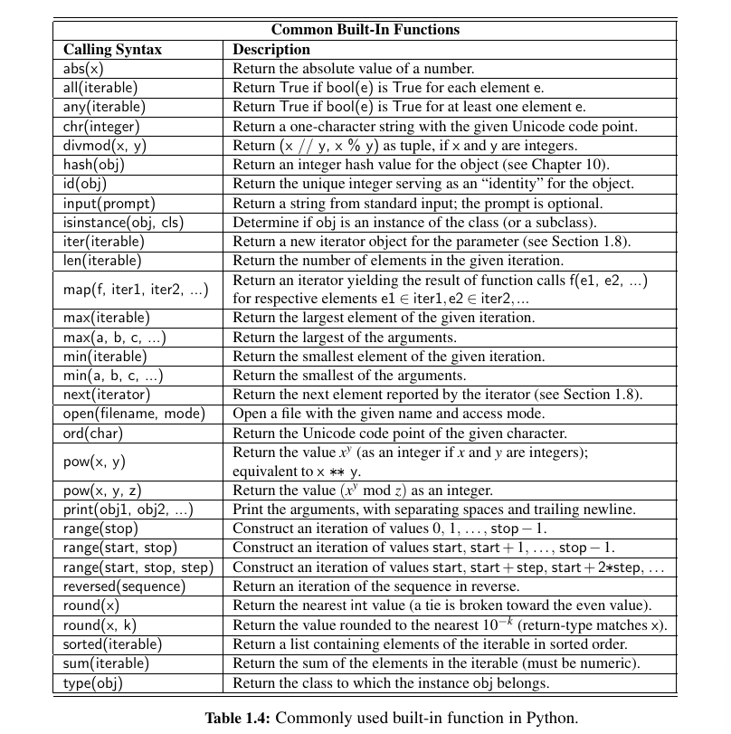

1.1 Overview
- Python-originally developed-Guido van Rossum-early 1990s
- Python 2-released in 2000--Python 3-released in 2008
- Python-interpreted language-stored with suffix .py
-  Python’s syntax relies heavily on the use of whitespace.

1.2 Objects in Python
- Python is an object-oriented language and classes form the basis for all data types.
- assignment statement(=)-> identifier = object
- identifiers in Python are case-sensitve.
- 

